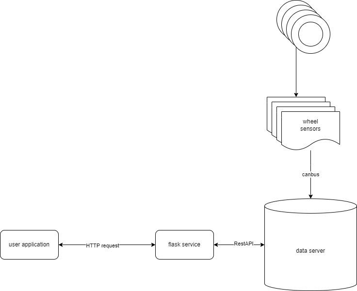

= Wheel Sensor Simulation

== Summary
This projects simulates a vehicle with 4 wheel sensors that continuously sends pressure information to a Data Server via CANBUS interface.

The Data Server collects all data and listen to RestAPI command to retrieve the collected data.

== Diagram

== Process phases
1. Sensors simulation - the simulate_sensors function in wheel_sensor.py script creates 4 processes, each runs a sensor that sends this data on the CanBus:
data = [
    group_id
    sensor_id
    wheel_position
    wheel_state
]

2. The Data server runs asynchronously (non blocking) and collects the data continuously from the CanBus to a devices dictionary

3. The Flask app runs on a dedicated thread (not for production) and awaits HTTP requests on port 5000

== APIs
The application listens on port 5000
for these APIs

=== wheel/status
Retrieves wheel sensors status

...

== Running the simulation

To run the program use the run_simulation.sh file
----
./run_simulation.sh
----

Use this command to retrieve the sensors data:
----
curl http://localhost:5000/wheel/status
----

This script installs all dependencies, creates a virtual Canbus interface (vcan0) if needed and runs the simulation.

== TBD

* Translate Canbus info using Protobuf
* add configuration file
* allow setting the number of the sensors
* add DB server to keep the sensors data
* after adding a DB server each component could be set as a microservice and run using docker compose file, this way we won't need to run Flask on a new thread